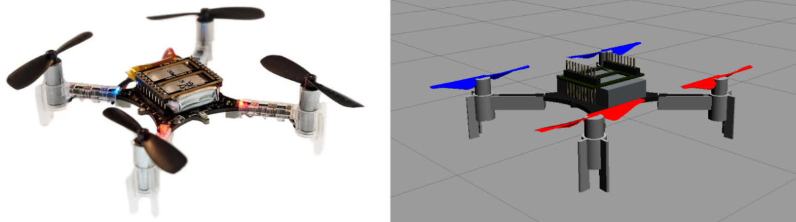

# Drone Trajectory Control
Robust Trajectory Tracking for Quadrotor UAVs using Sliding Mode Control in Gazebo.

## Contents
- Drone Trajectory Control
  - [1. Introduction](#1-introduction)
  - [2. Setup](#2-setup)
  - [3. Run](#3-run)
    - [i. Run Trajectory Generation Matlab](#i-run-trajectory-generation-matlab)
    - [ii. Run Drone Trajectory Tracking](#ii-run-drone-trajectory-tracking)
  - [4. Output](#4-output)

## 1. Introduction
This repo aims to develop a robust control scheme to enable a quadrotor in Gazebo simulation to track desired trajectories in the presence of external disturbances. More information about working can be found [here](https://github.com/dennyboby/drone_trajectory_control/tree/master/docs/document).

## 2. Setup
In order to setup the repository locally on your system, open a new terminal and follow the instructions below:

    cd ~
    mkdir -p rc_project/src
    cd rc_project/src
    git clone git@github.com:dennyboby/drone_trajectory_control.git
    cd ..
    catkin init
    catkin build -j4
    source devel/setup.bash

## 3. Run
This section discusses the execution files for trajectory tracking.

### i. Run Trajectory Generation Matlab
In order to run the trajectory generation run the matlab code `rc_project.m` which is present in `rc_project/src/drone_trajectory_control/matlab`.

### ii. Run Drone Trajectory Tracking
In order to run the trajectory tracking run the following commands in a new terminal.

    cd rc_project
    source devel/setup.bash
    roslaunch rotors_gazebo crazyflie2_without_controller.launch
    Press the play button in Gazebo.

Open another new terminal and run the following commands:

    cd rc_project
    source devel/setup.bash
    cd src/drone_trajectory_control/project/scripts
    python3 sliding_mode_control.py

## 4. Output
This section shows the output of the simulation.

https://user-images.githubusercontent.com/44564963/221396856-52728b21-dc64-48c9-8881-742e9f6a41a4.mp4

